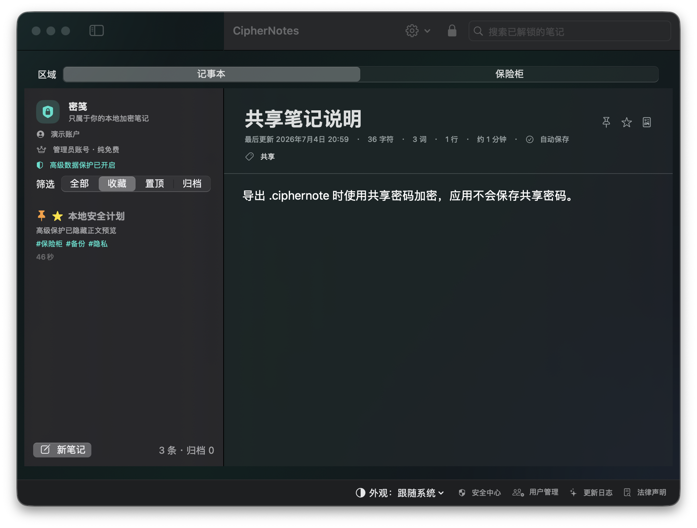

# CipherNotes / 密笺

A privacy-first, fully local encrypted notes app for macOS.

CipherNotes is built for private notes, photos, documents, archives, and other files you want to keep on your Mac instead of in a cloud account. It has no sync server, no analytics, no ads, no subscription, and no paid feature gate.

[Website](https://canonliuliang.github.io/CipherNotes/) · [Download latest release](https://github.com/canonliuliang/CipherNotes/releases/latest) · [Report an issue](https://github.com/canonliuliang/CipherNotes/issues)




## Download

Get the latest version from [GitHub Releases](https://github.com/canonliuliang/CipherNotes/releases/latest).

- Current release: `1.1.4` · 灵动登录面板.
- `密笺-1.1.4.pkg`: recommended public installer.
- `密笺-1.1.4.zip`: public portable archive.

Requires macOS 14 or later.

## Highlights

- Fully local encrypted notes and file vault for macOS.
- AES-256-GCM encryption for note payloads and vault files.
- Equal local accounts: no administrator account, no universal password, no hidden superuser.
- File vault for photos, PDFs, archives, scans, and large offline files.
- Chunked vault storage: large files are encrypted in 4 MB chunks, imported in the background, and exported by streaming.
- Recovery codes for account password reset.
- Local encrypted security log for sensitive events.
- Advanced Data Protection mode that tightens auto-lock and blocks copying, exporting, sharing, previews, and sensitive filename exposure.
- Decoy password option for Highest Protection: open a separately encrypted fake space that can save its own notes/files, or erase local data when configured.
- Local backup and restore.
- Free: no membership, purchase flow, restore purchase, or paid switch.

## Why Choose CipherNotes

CipherNotes is intentionally boring about privacy: your data stays on your Mac, the app has no account server, and the safest default is to keep private notes and files out of sync products you do not control.

- Local-first by design: no remote login, sync service, analytics endpoint, or paid cloud feature.
- Clear account boundaries: local accounts can be listed on the login screen, but each account's notes, file vault, recovery code, decoy space, and security log are protected separately.
- Built for offline files: the vault stores photos, scans, PDFs, archives, and large files as encrypted chunks instead of loading the whole file into memory.
- Defensive UX: Advanced Data Protection hides previews, blocks export/share/copy paths, tightens auto-lock, and writes local security events without leaking note titles or filenames.
- Predictable updates: public downloads come only from GitHub Releases, so every installer has release notes, version metadata, and reproducible packaging steps.

## Screenshots And Website

- Product website: [canonliuliang.github.io/CipherNotes](https://canonliuliang.github.io/CipherNotes/)
- Screenshots live in [docs/media](docs/media).
- Download buttons on the website point to [Releases latest](https://github.com/canonliuliang/CipherNotes/releases/latest).

## Privacy Boundary

CipherNotes does not upload notes, files, account data, usage events, recovery codes, or passwords. There is no remote account and no cloud recovery.

What is stored locally:

- Account display names, so the login screen can show local accounts.
- Salted username hashes for local username matching.
- Encrypted note payloads.
- Encrypted vault file chunks.
- Encrypted local security logs.

What is not stored in plaintext:

- Note titles and bodies.
- Vault file contents.
- Account passwords.
- Recovery codes.
- Shared-note passwords.
- Sensitive security-log object names such as note titles, file names, or note bodies.

If you forget an account password and lose its recovery code, that account's encrypted content cannot be recovered. Other accounts are not master keys.

## Data Location

Default vault file:

```text
~/Library/Application Support/CipherNotes/vault.json
```

Encrypted vault file chunks:

```text
~/Library/Application Support/CipherNotes/Attachments/
```

## Develop

Requires macOS 14 or later and a Swift 6 capable Xcode toolchain.

```sh
swift run --scratch-path /tmp/ciphernotes-run CipherNotes
```

You can also open `Package.swift` in Xcode and run the `CipherNotes` scheme.

## Test

```sh
swift test --scratch-path /tmp/ciphernotes-test
```

## Package

Release metadata is centralized in `Packaging/release.env`. Before publishing a new download, update that file, then run:

```sh
Packaging/build-release.sh
```

The script runs tests, builds the release app, and updates:

- `outputs/密笺-<version>.pkg`
- `outputs/密笺-<version>.zip`
- `outputs/使用说明.md`
- `outputs/产品介绍.html`
- `outputs/密笺图标.png`

The repository avoids keeping an expanded `.app` bundle in `outputs` to reduce Spotlight and Git noise. Unzip the release archive when you need the app bundle.

## Update The Local App

For development, update the CipherNotes app installed on this Mac with:

```sh
Packaging/update-local-app.sh
```

This script runs the release build, updates `outputs`, closes the running app if needed, copies the freshly built `密笺.app` to `/Applications`, verifies the signature, and opens the updated app. If direct copying to `/Applications` is denied, it falls back to the generated installer package and may ask for your macOS password.

This only updates your local Mac. Users still get updates from GitHub Releases.

## Publish A Public Download

Pushing source code to GitHub updates the repository and GitHub Pages, but it does not update what users download from the website by itself. The website download button points to GitHub Releases latest.

To publish a new public download:

```sh
git push origin main
git tag v1.1.4
git push origin v1.1.4
```

If you are using GitHub Desktop and do not want to push tags from Terminal, push `main`, open the repository's Actions tab, choose the `Release` workflow, and run it manually. Leave the tag field empty to use `Packaging/release.env`.

The `Release` workflow validates the version, runs the package script, creates or updates the GitHub Release, and uploads the generated `pkg`, `zip`, release notes, usage guide, website output, and icon.

## Release Safety Checks

`Packaging/validate-release.sh` is shared by local packaging, CI, and the GitHub Release workflow. It fails the build if release metadata drifts across:

- `Packaging/release.env`
- `Packaging/RELEASE_NOTES.md`
- `Packaging/Info.plist`
- `README.md`
- `Website/index.html`
- `docs/index.html`
- the in-app changelog in `Sources/CipherNotes/Views.swift`

This keeps the app version, GitHub download page, website, README, and in-app update log aligned before users see a release.

## Version Rule

- Patch version, for example `1.0.4` to `1.0.5`: any user-visible feature, security behavior, data model, legal text, or release process change.
- Build number, for example `29` to `30`: every packaging iteration, even when the marketing version stays the same.
- GitHub Release tag must match `Packaging/release.env`. Users only get a new installer after the matching Release is created or updated.

## Upgrade From Older Vaults

Older vaults can be upgraded from the migration screen. Enter the old username and old master password; the old password becomes the new local account password, and existing notes are preserved. If you do not need the old data, you can discard the old vault and start fresh.

## Changelog

### 1.1.4 - 灵动登录面板

- Keeps the three-way account selector fixed while the glass form panel smoothly resizes to login, registration, or recovery content.
- Adds restrained spring sizing and subtle content transitions, with Reduce Motion support.
- Anchors the panel so it expands downward instead of making the selector jump.
- Restores all bottom-window utilities as direct controls instead of hiding them under More.

### 1.1.3 - 登录页渲染修复

- Removed the login scroll-container path that could show a blank window immediately after launch.
- Restored the stable native window layout for login, registration, and recovery while retaining the compact form sizing.
- Added an automated assertion that the direct login screen contains rendered foreground content, not only a background.

### 1.1.2 - 登录稳定性与安全入口

- Removed the account-entry geometry path that could leave a restored window blank.
- Login, registration, and recovery now use one stable native scrolling surface at every window height.
- Restored Security Center as the visible primary control; Appearance is now grouped under More with the secondary utilities.

### 1.1.1 - 登录界面与窗口适配

- Rebuilt the account entry view around adaptive vertical space instead of a fixed-height form.
- Normal window sizes keep the account panel centered; compact windows keep every field and action reachable in a native scroll view.
- Consolidated the global bottom controls into macOS menus so none of them can overflow the window width.
- Preserved every account, security, appearance, changelog, and legal entry point while making the first screen calmer and easier to scan.

### 1.1.0 - 内置媒体与大文件体验

- Rebuilt the vault viewer around native in-app image, PDF, text, audio, and video surfaces.
- Streams audio and video from encrypted 4 MB chunks without plaintext temporary files or external apps.
- Added background image downsampling, bounded LRU thumbnail caching, import pause/resume, and background deletion for large files.
- Added debounced indexed note search, versioned per-account KDF metadata, vault recovery copies, backup SHA-256 manifests, and encrypted security-audit export.
- Added automated 860x620 light/dark/accent rendering checks and upgraded GitHub Actions away from Node.js 20 actions.

### 1.0.9 - 安全加固与性能优化

- Batched note title, body, and tag updates into one encrypted write and skipped no-op saves.
- Moved files of 4 MB or larger to background vault encryption to keep the interface responsive.
- Added login backoff, mandatory shared-note passwords, package size limits, and stricter encrypted-chunk validation.
- Rotated recovery codes after password changes and hardened account deletion, backup restore, import cancellation, and local-data erasure paths.

### 1.0.8 - 正式版收口与稳定性优化

- Removed the separate demo build and demo-only release assets; the public download now contains one production app.
- Stabilized Notes/Vault switching and replaced the file action popover with the native macOS menu.
- Unified the public version metadata at `1.0.8 (33)`.

### 1.0.7 - macOS 原生界面与 Liquid Glass 收口

- Reworked the main window around native macOS hierarchy: sidebar, toolbar, content, and floating surfaces.
- Limited Liquid Glass to controls and floating panels; note reading and editing remain clear system-background content areas.
- Reduced custom gradients, saturated colors, hard borders, and heavy shadows in favor of system colors and native materials.
- Improved dark-mode and accent-color behavior across buttons, status indicators, and selection surfaces.

### 1.0.6 - 安全日志与保护模式收敛

- Reduced local security-log noise with a 120-entry retention limit, duplicate-event coalescing, and a 40-row UI window.

### 1.0.5 - 安全模型与虚假空间修复

- Removed device biometric unlock from the product surface; login now uses account password plus recovery code only.
- Made decoy spaces persistent and separately encrypted, so decoy notes and vault files can be saved without touching real data.
- Fixed login mode switcher height so switching between login, registration, and recovery no longer makes the panel jump.
- Made Highest Protection enable/disable buttons visually distinct instead of using the same color for opposite actions.
- Expanded the legal/privacy disclosure with clearer threat boundaries and limitations.
- Clarified the version rule: feature/security changes get a new patch version; build numbers only track packaging iterations.

### 1.0.4 - 界面层级与外观修复

- Added a main workspace status strip for current account, protection mode, auto-lock, and vault count.
- Reworked Account & Security to follow the clearer Security Center hierarchy: status cards, account section, password section, and danger zone.
- Turned Advanced Data Protection into a clearer mode card that lists the blocked copy/export/share/preview paths.
- Made decoy password setup calmer by keeping destructive erase mode behind an explicit reveal.
- Added a vault import queue with per-file progress for large encrypted imports.
- Fixed appearance switching by syncing SwiftUI and AppKit, so menus, alerts, and file panels follow the selected light/dark mode.
- Improved custom button contrast in both light and dark modes.
- Added editor save feedback with `正在保存` / `已保存` state and a manual save control.
- Added actionable empty states for notes, search results, and archive views.
- Added a Security Center version/update card with direct links to the latest GitHub Release and website.
- Made Security Center quick actions and backup controls adapt to narrow windows.
- Stabilized the Notes/Vault workspace switcher height so switching sections no longer makes the top control jump.
- Moved the workspace toolbar to the shared container so Notes and Vault keep the same chrome height.
- Kept the notes sidebar protection status visible in both standard and advanced modes to avoid header height changes.
- Made the Vault header and file-type filter adapt without sudden wrapping at common window widths.
- Added shared release validation for local packaging, CI, and GitHub Release publishing.
- Improved the README with a clearer product story, "Why Choose CipherNotes", release safety checks, and large-file vault positioning.
- Added an in-app manual update check that compares the current app version with GitHub Releases latest.
- Improved vault large-file imports with cancellation, remaining-time estimates, and clearable completed import records.
- Added no-temp-file internal vault viewers for images, text, and PDFs so protected files do not need external apps.
- Added an in-memory audio vault player for common audio files, avoiding temporary plaintext exports and external player launch.
- Added a Highest Protection privacy shield that covers the app and clears preview caches when the window becomes inactive.
- Kept video files inside the vault instead of opening external apps; a hardened no-temp-file video player is planned separately.
- Reframed Advanced Data Protection as a stricter Highest Protection mode in the security UI.
- Added attachment-directory Spotlight prevention with `.metadata_never_index` and lock-time preview cache cleanup.
- Improved the Account & Security danger zone: delete-account and erase-all-data now show separate confirmation requirements.
- Disabled destructive buttons until the current password is entered and the exact confirmation text matches the selected action.
- Changed Security Center and Account & Security sheets to use more flexible window sizing.
- Kept release metadata, README, website, GitHub Pages, packaging, and in-app changelog aligned.

### 1.0.3 - GitHub 风格官网与发布流程

- Rebuilt the product website with a GitHub-inspired repository layout, release card, README section, privacy matrix, and cleaner SVG icon system.
- Added clearer release guidance: source pushes do not update public downloads until a GitHub Release is created or updated with new assets.
- Synchronized website, GitHub Pages, and local product introduction output.
- Started tightening account/password UX with clearer release naming and safer version consistency.

### 1.0.2 - 虚假密码与清晰按钮

- Added Advanced Data Protection decoy password actions for fake-space entry or local data destruction.
- Added an early decoy space that did not read the real vault.
- Improved button contrast for the bottom toolbar, vault cards, account rows, Security Center sections, and security log rows.
- Updated the in-app changelog so recent security changes are visible inside the app.

### 1.0.1 - 本地安全日志与高级保护收口

- Added encrypted local security logs in Security Center.
- Blocked copy, plain export, shared import/export, vault preview, vault export, and sensitive filename copying when Advanced Data Protection is enabled.
- Removed external password-manager helper prompts.
- Reworked README and website download links around GitHub Releases latest.

### 1.0.0

- Removed membership, purchases, restore purchase, and all paid feature gates.
- Removed the administrator model. All accounts are equal local accounts.
- Removed external password-manager helper prompts.
- Added local encrypted security logs in Security Center.
- Added Advanced Data Protection blocking for copy, export, sharing, vault preview, vault export, and sensitive filename copying.
- Added Advanced Data Protection decoy password actions for fake-space entry or local data destruction.
- Improved local password and recovery-code messaging.
- Added chunked encrypted vault storage for large files.
- Added backup and restore authorization with current account password and fixed confirmation text.
- Added first-run intro, in-app changelog, legal/privacy disclosure, and release packaging flow.

### 0.10.0

- Converted account setup to local account creation.
- Added account recovery codes.
- Added account and safety management.
- Added local backup and restore.

### 0.9.x

- Added Advanced Data Protection account setting.
- Added pinned, favorite, archived notes, tags, Markdown preview, and note export.
- Added vault filtering, total size, filename copying, and large-file work.

### 0.8.x

- Improved account upgrade behavior.
- Reduced repeated system prompts.
- Added motion preferences and calmer UI transitions.

### 0.7.x

- Added encrypted file vault.
- Moved files out of note payloads into independent encrypted vault storage.
- Added import-then-delete workflow for source files.

### 0.3.0 - 0.6.x

- Added multi-account login.
- Added recovery codes, legal/privacy disclosure, encrypted shared-note import/export, changelog, appearance settings, sorting, duplication, editor stats, and autosave improvements.

## License

MIT License. See [LICENSE](LICENSE).
